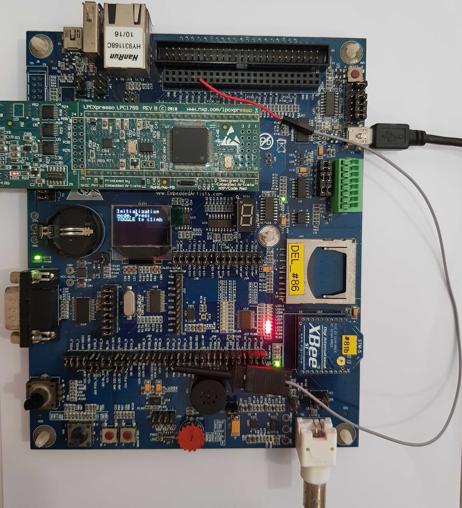
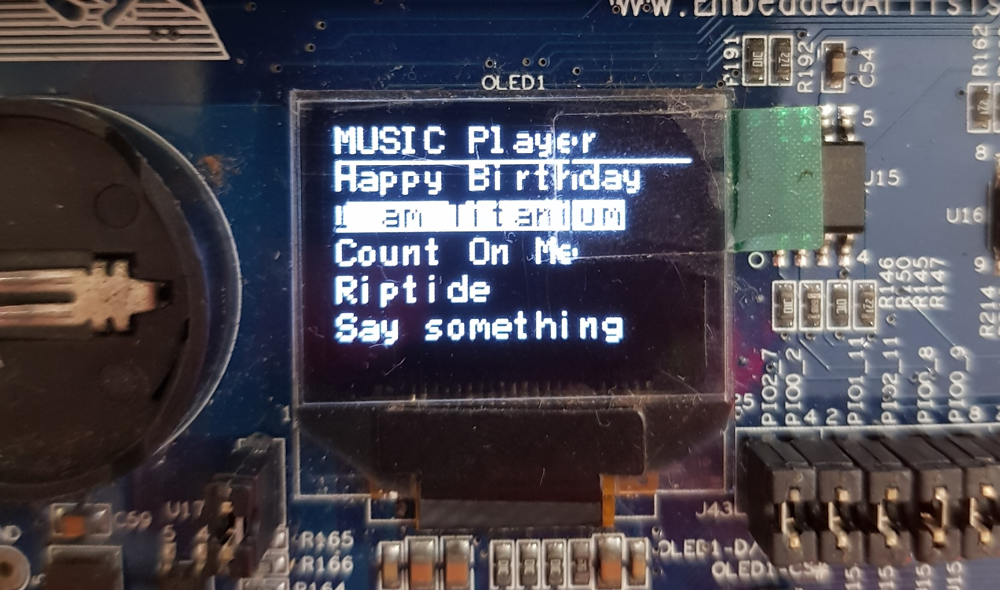

# FitNUS Fitness Tracker prototype
_Disclaimer: key portions of code removed to prevent plagarism. Codes avaliable upon request, [contact me](mailto:terence.neo@u.nus.edu)._

### Basic Features
FitNUS detects acceleration, light and temperature changes. FitNUS sends data periodically to a server known as FiTrackX. The XBee RF module acts as a low powered wireless communication device that sends collected data to FiTrackX.
<!-- todo: brief summary of flowchart actions -->

### Cool Features
<!-- todo: bullet points extra features -->

---
## Getting Started
### Environment Prerequisites
#### Software used
- LPCXpresso V6.1.4 194

#### Languages used
- Assembly
- C

#### Hardware
- LPCXpresso Base Board revB
- LPC1769 with ARM Cortex M3 Microcontroller
- XBee RF module _(optional, for wireless transmit and receive functions)_

## Deployment

## Authors
- [Terence Neo](https://github.com/terenceneo)
- Rachel Neo

## Acknowledgements
- Dr [Rajesh Panicker](https://www.rajeshpanicker.com) for being such an inspiration
- Prof [Thamn Chen Khong](https://www.ece.nus.edu.sg/stfpage/eletck/) for the awesome lessons and materials
- Christopher Moy for delivering labs lessons that are second to none (seriously, you got to experience them yourself)
- TA Kenneth for allowing me to bug you with my never ending supply of questions
- My friends [Clive Yuan](https://www.linkedin.com/in/clive-yuan-aaa69a157/) and Jason Loo for your continuous support, giving me inspiration for speeding up my implementations and teaching me how to use EINT0